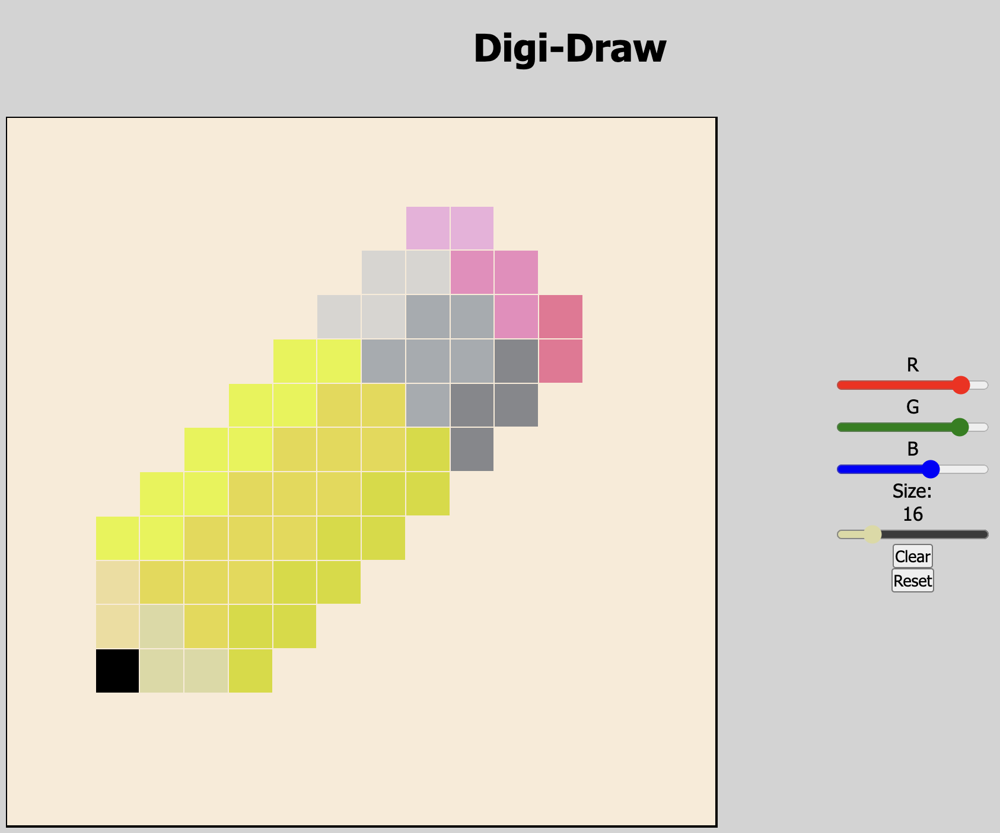

# Digi-Draw

  <kbd>
    
  </kbd>

## Description

A digital drawing tool. Made to explore basic DOM manipulation.

### Features

- Choose your pixel size and color, and you can draw on the canvas.
- Toggle on or off gridlines

### Built with

- HTML
- CSS
- JS

### To-do

- [ ] Add Eraser tool
- [ ] Add Eye Dropper tool
- [ ] Add cursor preview option
- [ ] Add Download/Save capabilies

### License

This project is licensed under the [MIT License](LICENSE.md).
